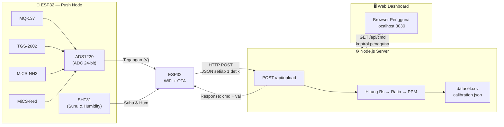
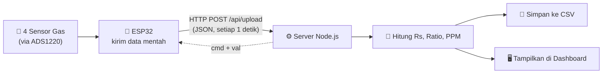

# 🧪 NH3 Server — Amonia Gas Sensor Dashboard

> **Server backend + web dashboard** untuk memantau, mengkalibrasi, dan merekam data sensor gas amonia (NH₃) secara real-time dari perangkat **ESP32** menggunakan empat sensor gas: **MQ-137**, **TGS-2602**, **MiCS-NH3**, dan **MiCS-Red**.

---

## 📋 Daftar Isi

- [Fitur Utama](#-fitur-utama)
- [Arsitektur Sistem](#-arsitektur-sistem)
- [Komponen Hardware](#-komponen-hardware)
- [Sensor yang Digunakan](#-sensor-yang-digunakan)
- [Struktur Folder](#-struktur-folder)
- [Firmware ESP32](#-firmware-esp32)
- [Prasyarat](#-prasyarat)
- [Cara Menjalankan Server](#-cara-menjalankan-server)
  - [Metode 1: Node.js Langsung](#metode-1-nodejs-langsung)
  - [Metode 2: Docker Compose (Rekomendasi)](#metode-2-docker-compose-rekomendasi)
- [Dokumentasi API](#-dokumentasi-api)
- [Format Dataset CSV](#-format-dataset-csv)
- [Konfigurasi Kalibrasi](#-konfigurasi-kalibrasi)
- [Prosedur Kalibrasi](#-prosedur-kalibrasi)
- [Dashboard Web](#-dashboard-web)
- [Troubleshooting](#-troubleshooting)
- [Dependensi](#-dependensi)

---

## ✨ Fitur Utama

| Fitur | Keterangan |
|---|---|
| 🔄 **Real-time Monitoring** | Data sensor diperbarui setiap detik dari ESP32 via HTTP POST |
| 📊 **Web Dashboard** | Antarmuka grafis interaktif dengan chart riwayat nilai Rs & PPM |
| 🎯 **Kalibrasi Otomatis** | Proses kalibrasi R₀ selama 30 detik untuk akurasi pengukuran |
| 💾 **Perekaman Dataset** | Ekspor data ke file `dataset.csv` untuk kebutuhan machine learning |
| 🏷️ **Pelabelan Manual** | Tambahkan label kelas (Class Label & PPM Aktual) langsung dari dashboard |
| 🐳 **Docker Ready** | Deploy mudah menggunakan Docker Compose dengan persistent data |
| 🌗 **Dark / Light Mode** | Tampilan dapat beralih antara tema gelap dan terang |
| 🔁 **State Recovery** | Total baris dataset tidak akan hilang meski server di-restart |
| 🔌 **OTA Update** | Firmware ESP32 dapat diperbarui secara nirkabel (ArduinoOTA) |
| 🔒 **HTTPS Support** | ESP32 mendukung koneksi HTTPS ke server dengan `WiFiClientSecure` |
| 🛡️ **Anti-Drift Timer** | Pengiriman data dengan kompensasi waktu agar tidak drift |
| 📶 **WiFiManager** | Konfigurasi WiFi ESP32 via captive portal tanpa hardcode SSID |

---

## 🏗️ Arsitektur Sistem

Sistem terdiri dari dua bagian utama: **Firmware ESP32** sebagai *Push Node* yang membaca sensor, dan **Server Node.js** yang memproses data serta menyajikan dashboard web.

### Blok Diagram



### Alur Data



**Penjelasan Alur:**
1. **ESP32** membaca 4 sensor gas via **ADS1220** (ADC 24-bit, rata-rata 8 sampel) dan suhu/humidity via **SHT31**
2. Data mentah dikirim setiap **1 detik** via **HTTP POST** ke `/api/upload`
3. **Server** menghitung Rs, Ratio Rs/R₀, dan estimasi PPM menggunakan rumus power law
4. Jika stream aktif, baris data ditulis ke **`dataset.csv`**
5. Server mengembalikan **perintah kontrol** (`cmd`) ke ESP32 — misalnya: heater on/off, reboot
6. **Dashboard web** polling `/api/data` setiap detik untuk menampilkan grafik dan status real-time

---

## 🔩 Komponen Hardware

| Komponen | Fungsi | Interface / Pin |
|---|---|---|
| **ESP32** | Mikrokontroler utama, WiFi, OTA | — |
| **ADS1220** | ADC 24-bit presisi tinggi, baca tegangan sensor | SPI (`CS=5`, `DRDY=4`) |
| **SHT31** | Sensor suhu & kelembaban | I2C (`SDA=21`, `SCL=22`) |
| **MQ-137** | Sensor gas NH₃ (tipe MQ, resistif) | ADS1220 Channel 0 |
| **TGS-2602** | Sensor gas NH₃/VOC (tipe TGS, resistif) | ADS1220 Channel 3 |
| **MiCS-NH3** | Sensor gas NH₃ (tipe MiCS, resistif) | ADS1220 Channel 1 |
| **MiCS-Red** | Sensor gas reduksi (tipe MiCS, resistif) | ADS1220 Channel 2 |
| **Heater MQ-137** | Elemen pemanas sensor MQ-137 | GPIO 25 |
| **Heater TGS-2602** | Elemen pemanas sensor TGS-2602 | GPIO 26 |
| **LED Status WiFi** | Indikator koneksi WiFi berhasil | GPIO 2 |

---

## 🔬 Sensor yang Digunakan

| Sensor | Gas Target | Rentang PPM | Resistansi Beban (RL) | Koefisien A | Koefisien B |
|---|---|---|---|---|---|
| **MQ-137** | NH₃ | 0 – 500 ppm | 47 kΩ | 0.402 | -2.51 |
| **TGS-2602** | NH₃ / VOC | 0 – 30 ppm | 10 kΩ | 0.592 | -2.35 |
| **MiCS-NH3** | NH₃ | 0 – 300 ppm | 47 kΩ | 0.637 | -2.03 |
| **MiCS-Red** | Gas Reduksi | 0 – 1000 ppm | 47 kΩ | 0.777 | -2.39 |

> 📐 **Perhitungan PPM** menggunakan rumus power law: **`PPM = A × (Rs/R₀)^B`**

> 📐 **Rumus Rs** berbeda tiap tipe sensor:
> - **MQ-137 & TGS-2602:** `Rs = RL × (Vs − Vout) / Vout` — tegangan naik saat terpapar gas
> - **MiCS-NH3 & MiCS-Red:** `Rs = RL × Vout / (Vs − Vout)` — tegangan turun saat terpapar gas

---

## 📁 Struktur Folder

```
nh3-server/
├── 📄 NH3_SERVER.ino       # Firmware ESP32 — Push Node sensor gas
├── 📄 server.js            # Server utama Node.js (Express.js REST API)
├── 📄 package.json         # Konfigurasi dependensi Node.js
├── 📄 Dockerfile           # Image Docker berbasis Node 18 Alpine
├── 📄 docker-compose.yml   # Orkestrasi container dengan volume persisten
├── 📄 calibration.json     # Data kalibrasi R₀ (di-generate otomatis)
├── 📄 dataset.csv          # File rekaman data sensor (di-generate otomatis)
└── 📂 public/
    └── 📄 index.html       # Web dashboard (HTML + CSS + Chart.js)
```

---

## 🤖 Firmware ESP32

File `NH3_SERVER.ino` adalah firmware untuk ESP32 yang berperan sebagai **"Push Node"** — perangkat yang membaca data sensor mentah dan mengirimkannya ke server secara berkala.

### Library yang Digunakan

| Library | Sumber | Fungsi |
|---|---|---|
| `WiFiManager` | Library Manager (tzapu) | Konfigurasi WiFi via captive portal (tanpa hardcode SSID) |
| `ArduinoOTA` | Built-in ESP32 Core | Update firmware nirkabel melalui jaringan WiFi |
| `Adafruit_SHT31` | Library Manager | Membaca sensor suhu & kelembaban SHT31 via I2C |
| `ADS1220_WE` | Library Manager (Wolfgang Ewald) | Membaca ADC eksternal ADS1220 via SPI |
| `HTTPClient` | Built-in ESP32 Core | Mengirim data ke server via HTTP/HTTPS POST |
| `ArduinoJson` | Library Manager (Benoit Blanchon) | Serialisasi/deserialisasi JSON |
| `WiFiClientSecure` | Built-in ESP32 Core | Koneksi HTTPS (menggunakan `setInsecure()`) |

### Konfigurasi Pin

```cpp
#define SDA_PIN      21   // I2C Data  — SHT31
#define SCL_PIN      22   // I2C Clock — SHT31
#define ADS_CS_PIN    5   // SPI Chip Select — ADS1220
#define ADS_DRDY_PIN  4   // SPI Data Ready  — ADS1220
#define HEATER_MQ137 25   // Output kontrol Heater MQ-137
#define HEATER_TGS   26   // Output kontrol Heater TGS-2602
#define LED_WIFI      2   // Output indikator LED WiFi
```

### Mengatur URL Server

Ubah konstanta `SERVER_URL` di bagian atas file `.ino` sesuai dengan alamat server Anda:

```cpp
// Contoh: server dengan domain publik (HTTPS)
const String SERVER_URL = "https://nh3.ijuloss.my.id/api/upload";

// Contoh: server lokal (HTTP)
const String SERVER_URL = "http://192.168.1.100:3030/api/upload";
```

### Perintah yang Diterima ESP32 dari Server

Server dapat mengirim perintah balik kepada ESP32 melalui response JSON dari `/api/upload`:

| Perintah (`cmd`) | Fungsi |
|---|---|
| `h` | Nyalakan **kedua heater** (MQ-137 & TGS-2602) |
| `H` | Matikan **kedua heater** |
| `h1` | Toggle (on/off) heater **MQ-137** |
| `h2` | Toggle (on/off) heater **TGS-2602** |
| `reboot` | Restart ESP32 (`ESP.restart()`) |
| `wifi_reset` | Reset konfigurasi WiFiManager & restart ESP32 |

### Fitur Anti-Drift & Anti-Blocking

Firmware menggunakan dua mekanisme penting untuk menjaga keandalan:

| Mekanisme | Cara Kerja |
|---|---|
| **Anti-Drift Timer** | Menggunakan `tSensorRead += T_SENSOR_READ` (bukan `= millis()`) agar waktu pengiriman tidak bergeser meskipun eksekusi bervariasi durasinya |
| **Anti-Blocking HTTP** | `http.setTimeout(1500)` membatasi waktu tunggu POST maksimum 1.5 detik, mencegah ESP32 hang jika server lambat |

### Rata-rata Sampel ADC (Noise Reduction)

Setiap siklus pengiriman, firmware membaca ADC sebanyak **8 kali** dan merata-ratakannya:

```cpp
static const uint8_t AVG_N = 8; // Rata-rata 8 sampel untuk meredam noise
```

### Setup WiFi (Pertama Kali / Setelah Reset)

Saat pertama dinyalakan atau setelah `wifi_reset`, ESP32 membuka **Access Point** bernama **`NH3-Node`**. Hubungkan perangkat ke AP tersebut, lalu portal konfigurasi akan muncul otomatis untuk memasukkan SSID dan password WiFi.

---

## 🛠️ Prasyarat

### Untuk Upload Firmware ESP32

- **Arduino IDE** atau **PlatformIO**
- Install library berikut via Arduino Library Manager:
  - `WiFiManager` (by tzapu)
  - `Adafruit SHT31 Library`
  - `ADS1220_WE` (by Wolfgang Ewald)
  - `ArduinoJson` (by Benoit Blanchon)
  - *(ArduinoOTA & WiFiClientSecure sudah termasuk di ESP32 Arduino Core)*

### Untuk Menjalankan Server (Node.js)

- **Node.js** versi `18` atau lebih baru
- **npm** (sudah termasuk dalam instalasi Node.js)

### Untuk Menjalankan Server (Docker)

- **Docker Engine** versi `20.10` atau lebih baru
- **Docker Compose** versi `v2` atau lebih baru

---

## 🚀 Cara Menjalankan Server

### Metode 1: Node.js Langsung

```bash
# 1. Masuk ke direktori proyek
cd nh3-server

# 2. Install dependensi
npm install

# 3. Jalankan server
npm start
```

Server akan berjalan di **http://localhost:3000**

---

### Metode 2: Docker Compose (Rekomendasi)

Direkomendasikan untuk deployment di server/CasaOS karena data `dataset.csv` dan `calibration.json` otomatis tersimpan di folder host (tidak hilang saat container di-restart).

```bash
# 1. Masuk ke direktori proyek
cd nh3-server

# 2. Build dan jalankan container di background
docker compose up -d --build

# 3. Cek status container
docker compose ps

# 4. Lihat log real-time (opsional)
docker compose logs -f

# 5. Hentikan container
docker compose down
```

> **Port:** Server diekspos di **http://localhost:3030** (pemetaan port `3030:3000`)

---

## 📡 Dokumentasi API

### `POST /api/upload`
Endpoint utama untuk menerima data dari ESP32.

**Request Body (JSON):**
```json
{
  "v_mq":       1.23,
  "v_tgs":      0.87,
  "v_mn3":      2.10,
  "v_mrd":      1.55,
  "temp":       28.5,
  "hum":        65.2,
  "heater_mq":  true,
  "heater_tgs": true,
  "sht_ok":     true,
  "wifi_ok":    true,
  "wifi":       "NamaSSID",
  "ip":         "192.168.1.50",
  "rssi":       -65,
  "uptime":     3600,
  "heap":       200000,
  "ads_ok":     true,
  "sht_init":   true
}
```

**Response (JSON):**
```json
{
  "cmd": "h",
  "val": ""
}
```
> Server mengembalikan perintah (`cmd`) yang akan dieksekusi oleh ESP32 pada siklus berikutnya.

---

### `GET /api/data`
Mengambil snapshot data terbaru yang telah diolah server.

**Response:** Objek JSON lengkap berisi nilai tegangan, Rs, Ratio, PPM kalkulasi, status kalibrasi, status stream, info koneksi ESP32, dan lain-lain.

---

### `GET /api/cmd?cmd={perintah}&val={nilai}`
Mengirim perintah kontrol ke server dari dashboard web.

| Parameter `cmd` | Parameter `val` | Fungsi |
|---|---|---|
| `s` | *(kosong)* | **Mulai** perekaman data ke CSV |
| `x` | *(kosong)* | **Berhenti** merekam data |
| `c` | *(kosong)* | **Mulai kalibrasi** R₀ (30 detik) |
| `label` | `"AMAN"` / `"BAHAYA"` | Set label nama kelas |
| `cl` | `0` / `1` / `2` | Set nomor kelas (integer) |
| `ppm` | `"25.5"` | Set nilai PPM aktual (ground truth) |
| `file_clear` | *(kosong)* | **Hapus/reset** file dataset CSV |
| `h` | *(kosong)* | Teruskan perintah nyalakan heater ke ESP32 |
| `H` | *(kosong)* | Teruskan perintah matikan heater ke ESP32 |
| `reboot` | *(kosong)* | Teruskan perintah reboot ke ESP32 |
| `wifi_reset` | *(kosong)* | Teruskan perintah reset WiFi ke ESP32 |

**Contoh Request:**
```
GET /api/cmd?cmd=s
GET /api/cmd?cmd=label&val=BAHAYA
GET /api/cmd?cmd=ppm&val=50
GET /api/cmd?cmd=file_clear
GET /api/cmd?cmd=h
```

---

### `GET /dataset.csv`
Mengunduh file `dataset.csv` yang tersimpan di server.

---

## 📊 Format Dataset CSV

Data direkam dalam format CSV dengan **19 kolom** berikut:

| # | Kolom | Tipe | Keterangan |
|---|---|---|---|
| 1 | `No` | Integer | Nomor urut baris |
| 2 | `Timestamp_ms` | Integer | Unix timestamp milidetik |
| 3 | `Humidity` | Float | Kelembaban relatif (%) |
| 4 | `Temperature` | Float | Suhu (°C) |
| 5 | `Rs_MQ137_kOhm` | Float | Resistansi sensor MQ-137 (kΩ) |
| 6 | `Rs_TGS2602_kOhm` | Float | Resistansi sensor TGS-2602 (kΩ) |
| 7 | `Rs_MiCS_NH3_kOhm` | Float | Resistansi sensor MiCS-NH3 (kΩ) |
| 8 | `Rs_MiCS_Red_kOhm` | Float | Resistansi sensor MiCS-Red (kΩ) |
| 9 | `Ratio_MQ137` | Float | Rasio Rs/R₀ sensor MQ-137 |
| 10 | `Ratio_TGS2602` | Float | Rasio Rs/R₀ sensor TGS-2602 |
| 11 | `Ratio_MiCS_NH3` | Float | Rasio Rs/R₀ sensor MiCS-NH3 |
| 12 | `Ratio_MiCS_Red` | Float | Rasio Rs/R₀ sensor MiCS-Red |
| 13 | `PPM_Calc_MQ` | Float | Estimasi PPM oleh MQ-137 |
| 14 | `PPM_Calc_TGS` | Float | Estimasi PPM oleh TGS-2602 |
| 15 | `PPM_Calc_MN3` | Float | Estimasi PPM oleh MiCS-NH3 |
| 16 | `PPM_Calc_MRD` | Float | Estimasi PPM oleh MiCS-Red |
| 17 | `PPM_Actual` | Float | PPM aktual (diinput manual sebagai ground truth) |
| 18 | `Class_Label` | Integer | Nomor kelas (0, 1, 2, ...) |
| 19 | `Class_Name` | String | Nama label kelas (contoh: "AMAN", "BAHAYA") |

---

## ⚙️ Konfigurasi Kalibrasi

File `calibration.json` dibuat dan diperbarui otomatis oleh server setelah proses kalibrasi selesai.

**Contoh isi `calibration.json`:**
```json
{
  "done":    true,
  "r0_mq":   112.724,
  "r0_tgs":  28.484,
  "r0_mn3":  867.146,
  "r0_mrd":  308.823
}
```

| Field | Keterangan |
|---|---|
| `done` | `true` jika kalibrasi sudah pernah dilakukan |
| `r0_mq` | Nilai R₀ rata-rata sensor MQ-137 (kΩ) |
| `r0_tgs` | Nilai R₀ rata-rata sensor TGS-2602 (kΩ) |
| `r0_mn3` | Nilai R₀ rata-rata sensor MiCS-NH3 (kΩ) |
| `r0_mrd` | Nilai R₀ rata-rata sensor MiCS-Red (kΩ) |

> ⚠️ File ini di-mount sebagai Docker volume sehingga **tidak perlu kalibrasi ulang** setiap kali container di-restart.

---

## 🎯 Prosedur Kalibrasi

Kalibrasi harus dilakukan di **udara bersih** (tanpa gas amonia) agar nilai R₀ akurat.

```
1. Upload firmware NH3_SERVER.ino ke ESP32
2. ESP32 terhubung ke WiFi — LED menyala ✅
3. Nyalakan heater dari dashboard (cmd=h) atau langsung dari perangkat
4. Tunggu minimal 5 menit (300 detik) hingga status "Warmup Ready" ✅
5. Pastikan sensor berada di udara bersih tanpa paparan NH₃
6. Klik tombol [MULAI KALIBRASI] di dashboard, atau kirim:
   GET /api/cmd?cmd=c
7. Server mengumpulkan 30 sampel nilai Rs selama 30 detik
8. Nilai R₀ tersimpan otomatis ke calibration.json ✅
9. Status berubah menjadi "Terkalibrasi" ✅
```

> ❗ **Penting:** Kalibrasi akan **gagal** jika heater belum menyala selama 5 menit penuh. Pastikan `warmup_ready = true` sebelum memulai.

---

## 🖥️ Dashboard Web

Akses dashboard melalui browser di:
- **Node.js langsung:** `http://localhost:3000`
- **Docker Compose:** `http://localhost:3030`
- **Jaringan lokal:** `http://<IP-SERVER>:3030`

**Fitur dashboard:**

| Panel | Fungsi |
|---|---|
| **Status Sistem** | Indikator koneksi ESP32, status stream, dan kalibrasi |
| **Info Perangkat** | IP ESP32, SSID WiFi, RSSI, uptime, free heap, status ADS/SHT |
| **Data Sensor** | Tabel nilai Rs (kΩ) dan Ratio (Rs/R₀) keempat sensor secara live |
| **Estimasi PPM** | Nilai PPM kalkulasi tiap sensor secara real-time |
| **Warmup Heater** | Progress bar countdown 5 menit warming up sensor |
| **Nilai R₀** | Tampilan nilai R₀ hasil kalibrasi yang tersimpan |
| **Chart Riwayat** | Grafik interaktif nilai Rs dan PPM (50 titik data terakhir) |
| **Kontrol Dataset** | Tombol Mulai/Berhenti rekam, set label, set PPM aktual, download CSV |
| **Kontrol Heater** | Toggle heater MQ-137 dan TGS-2602 dari browser |
| **Kontrol Kalibrasi** | Tombol mulai kalibrasi dan reset/hapus file dataset |
| **Dark / Light Mode** | Tombol toggle tema tampilan gelap/terang |

---

## 🔧 Troubleshooting

| Masalah | Kemungkinan Penyebab | Solusi |
|---|---|---|
| Dashboard tidak terhubung ke ESP32 | ESP32 offline / URL server salah | Periksa koneksi WiFi ESP32 dan `SERVER_URL` di `.ino` |
| ESP32 tidak bisa terhubung WiFi | SSID/password salah atau berubah | Kirim `cmd=wifi_reset` atau gunakan tombol reset WiFiManager |
| Kalibrasi gagal: "Heater belum siap" | Heater menyala < 5 menit | Tunggu hingga progress bar warmup penuh |
| PPM selalu bernilai `-1` | Kalibrasi belum dilakukan | Lakukan prosedur kalibrasi terlebih dahulu |
| Data CSV tidak tersimpan | Stream belum dimulai | Klik tombol **▶ Mulai Rekam** di dashboard |
| Container Docker terus restart | Port `3030` sudah digunakan | Ganti port host di `docker-compose.yml` |
| `calibration.json` hilang saat restart | Volume Docker tidak terkonfigurasi | Pastikan volume mapping di `docker-compose.yml` benar |
| Nilai Rs = 0 atau ADS gagal | ADS1220 tidak terdeteksi / wiring SPI | Periksa koneksi SPI (`CS=5`, `DRDY=4`) dan supply 5V |
| Suhu/Humidity = 0 | SHT31 tidak terdeteksi | Periksa wiring I2C (`SDA=21`, `SCL=22`) dan alamat `0x44`/`0x45` |
| HTTP POST selalu timeout | Server tidak terjangkau dari jaringan ESP32 | Periksa URL, port firewall, dan koneksi jaringan |

---

## 📦 Dependensi

### Server (Node.js)

| Package | Versi | Fungsi |
|---|---|---|
| [express](https://expressjs.com/) | `^4.18.2` | HTTP server & routing REST API |
| [Chart.js](https://www.chartjs.org/) | *(CDN)* | Grafik interaktif pada web dashboard |
| Node.js | `18-alpine` | Runtime JavaScript (via Docker image) |

### Firmware ESP32 (Arduino)

| Library | Sumber | Fungsi |
|---|---|---|
| `WiFiManager` | Library Manager (tzapu) | Konfigurasi WiFi via captive portal |
| `ArduinoOTA` | Built-in ESP32 Core | Update firmware nirkabel |
| `Adafruit SHT31` | Library Manager | Driver sensor suhu & kelembaban SHT31 |
| `ADS1220_WE` | Library Manager (Wolfgang Ewald) | Driver ADC ADS1220 via SPI |
| `ArduinoJson` | Library Manager (Benoit Blanchon) | Serialisasi/deserialisasi JSON |
| `WiFiClientSecure` | Built-in ESP32 Core | Koneksi HTTPS ke server |

---

## 📝 Lisensi

Proyek ini dibuat untuk keperluan **penelitian akademik** sistem deteksi gas amonia berbasis sensor array dan machine learning. Bebas digunakan dan dimodifikasi untuk keperluan pendidikan dan riset.

---

<div align="center">
  <sub>Dibuat dengan ❤️ untuk penelitian sensor gas NH₃ &nbsp;·&nbsp; ESP32 + ADS1220 + SHT31 + Node.js + Docker</sub>
</div>
